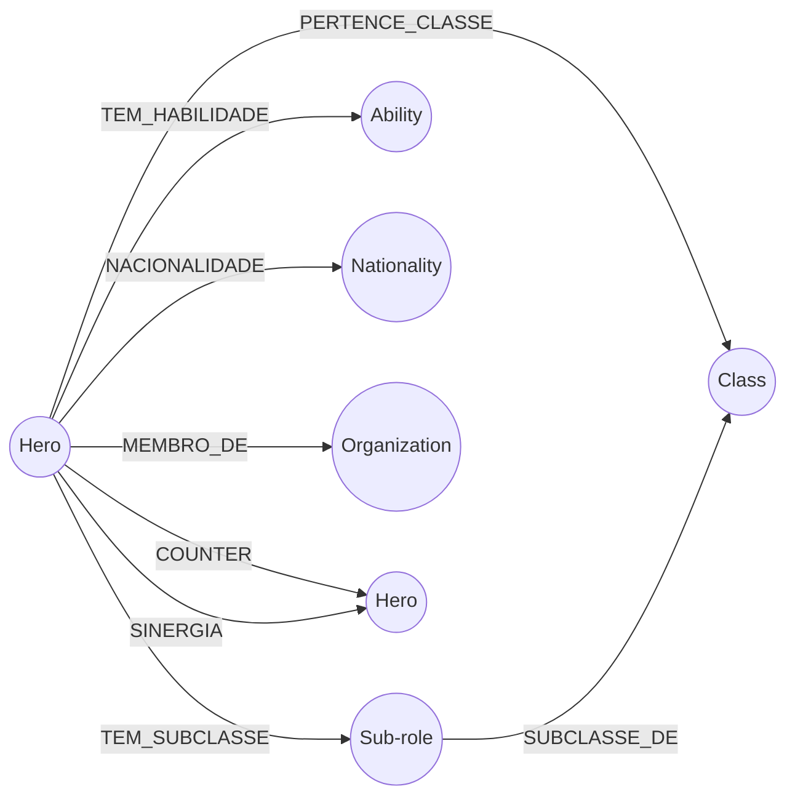

# Overwatch DataMeta

**An interactive knowledge graph of Overwatch 2: heroes, roles, abilities, lore, and the counters and synergies between them.**

[](https://overwatch-data-meta.vercel.app)


---

## About

Overwatch DataMeta models the Overwatch 2 roster as a **knowledge graph**. Each hero, role, sub-role, ability, nationality, organization, and map is a node. Edges carry meaning: *who counters whom*, *who synergizes with whom*, and *which class, faction, or country a hero belongs to*.

The idea was first prototyped in **Python with NetworkX** to learn how knowledge graphs work. It was then rebuilt in the browser with **D3.js** so you can explore, query, and edit the graph visually without a terminal.

> 🇧🇷 The interface and dataset labels are in Brazilian Portuguese.

## Features

- **Force-directed graph.** Nodes settle into a physics-based layout. Heroes are drawn as hexagons, and every other entity type is a colored circle.
- **Tactical relationships.** Counters (red, with an arrow showing direction) and synergies (green) each come with a short explanation of *why* the matchup works.
- **Filters.** Toggle node types (heroes, classes, sub-roles, maps, nationalities, organizations, abilities) and relation categories (counter, synergy, structural) on and off.
- **Search.** Type a hero, class, or map name to highlight matching nodes.
- **Details panel.** Click a node to see its properties and every relationship, grouped by type with reasons. Click a related node to jump to it.
- **Live editing.**
  - Add nodes of any existing type, or create a brand-new type.
  - Add relationships between any two nodes, including custom relation types (e.g. `RIVAL_OF`).
  - Remove individual relationships or whole nodes.
- **Import / Export.** Save the edited graph as JSON (`grafo_overwatch_editado.json`) and load it back later.
- **Reset.** Restore the original dataset at any time.
- **Navigation.** Drag nodes, scroll to zoom, and drag the background to pan.

> Edits live in memory for the current session only. Use **Export** to keep your changes.

## Dataset at a glance

The bundled dataset contains **154 nodes** and **292 relationships**.

| Node type | Count | | Relationship | Count |
|---|---:|---|---|---:|
| Hero | 43 | | `COUNTER` | 37 |
| Ability | 43 | | `SINERGIA` (synergy) | 32 |
| Nationality | 29 | | `PERTENCE_CLASSE` (belongs to class) | 43 |
| Sub-role | 20 | | `TEM_SUBCLASSE` (has sub-role) | 43 |
| Organization | 10 | | `TEM_HABILIDADE` (has ability) | 43 |
| Map | 6 | | `NACIONALIDADE` (nationality) | 42 |
| Class (Tank / Damage / Support) | 3 | | `MEMBRO_DE` (member of) | 26 |
| | | | `SUBCLASSE_DE` (sub-role of) | 20 |
| | | | `JOGAVEL_EM` (playable on) | 6 |

Every counter and synergy edge includes a `motivo` (reason), such as *"Barrier Field blocks the turret's fire"* for Reinhardt → Torbjörn.

## Data model



The graph is plain JSON with two arrays: `nos` (nodes) and `arestas` (edges). Exported and imported files use the same format:

```json
{
  "nos": [
    { "id": "heroi_reinhardt", "tipo": "Heroi", "nome": "Reinhardt", "propriedades": {} },
    { "id": "heroi_zenyatta",  "tipo": "Heroi", "nome": "Zenyatta",  "propriedades": {} }
  ],
  "arestas": [
    {
      "origem": "heroi_reinhardt",
      "destino": "heroi_zenyatta",
      "tipo": "SINERGIA",
      "propriedades": { "motivo": "Escudo protege o suporte enquanto o Orbe amplifica o dano do time" }
    }
  ]
}
```

## Getting started

There's no build step and nothing to install. The whole app is a single `index.html`.

**Online:** open the [live demo](https://overwatch-data-meta.vercel.app).

**Locally:**

```bash
git clone https://github.com/LucassTml/Overwatch-DataMeta.git
cd Overwatch-DataMeta
python -m http.server 8000
# then open http://localhost:8000
```

You can also open `index.html` directly in your browser. An internet connection is needed to load D3.js and Google Fonts from their CDNs.

### Python prototype

`ideia.py` is the original proof of concept. It builds a smaller directed graph with NetworkX and runs a couple of sample queries, such as *"Who does Winston counter?"* and *"Who does Pharah synergize with?"*.

```bash
pip install networkx matplotlib
python ideia.py
```

## Project structure

```
Overwatch-DataMeta/
├── index.html   # The full web app: styles, embedded dataset, and D3.js logic
└── ideia.py     # Python/NetworkX prototype of the knowledge graph
```

## Tech stack

- **[D3.js v7](https://d3js.org/):** force simulation, drag, and zoom
- **Vanilla JavaScript, HTML, and CSS:** no frameworks, no bundler
- **[NetworkX](https://networkx.org/):** graph modeling in the Python prototype
- **[Vercel](https://vercel.com/):** hosting

## Disclaimer

This is a fan-made, non-commercial project. It is not affiliated with or endorsed by Blizzard Entertainment. *Overwatch* and all related names are trademarks of Blizzard Entertainment, Inc.

---

Made by [Lucas Melo](https://github.com/LucassTml)
